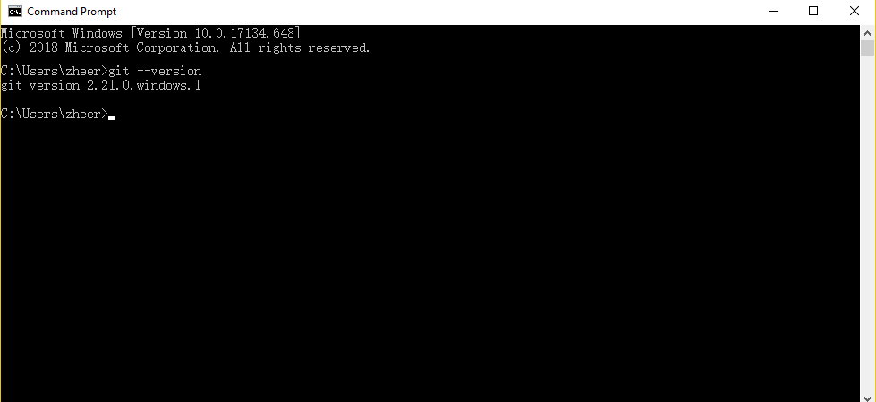

# Setup Your Development Environment For Windows

1. Install Git for Windows. Please go to https://git-scm.com/download to download the windows version and then install it on your PC. Default installation configuration is fine. You can follow the figures below if you are not sure about it.


2. Then you can use Windows Command Prompt to use these tools. You can use following command to check whether they are installed appropriately:

```
git --version

```



3. Then you can follow Steps 1 through  8 in the [OS X setup](./osx-setup) to  create a
GitHub account (if necessary), setting up ssh, and cloning the `cs50_dev` repo. Use Windows'
Command Prompt instead of MacOS Terminal.

>	NOTE: In step 5 there, you can simply copy your key by opening it directly. It's located in `C:\Users\YOUR_USER_NAME\.ssh\id_rsa.pub`. Please replace YOUR_USER_NAME within your user name. You can open it with Notepad, Sublime, etc.

>	Tip: You can also use Git Bash. You can easily find it by clicking right button in File Explorer. Please use the following command to check the existence of an ssh key and copy its content in Git Bash. (Thank you Themis for this useful tip!)
>
> ```
> ls -al ~/.ssh
> clip < ~/.ssh/id_rsa.pub
> ```
> 
>
> 
>
> 
>
